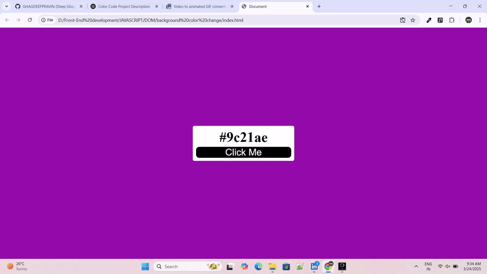
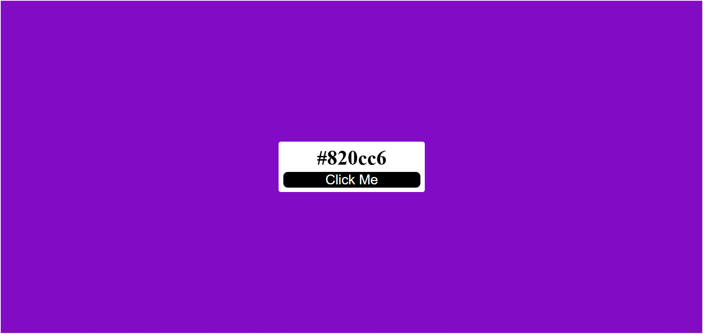

# 🎨 Color Generator

A simple color generator that provides random colors and their respective HEX, RGB, and HSL values.

## 📹 Demo Video

Click the image above to watch the demo video.

## 🚀 Features
- Generate random colors
- Copy color codes (HEX, RGB, HSL)
- Dark/Light mode support

## 🛠️ Usage
1. Click the **Generate** button to get a new color.
2. Copy the color code by clicking on it.
3. Toggle between **Light** and **Dark** modes for better visibility.

## 🖼️ Screenshot

## 🤝 Contributing
Feel free to submit pull requests or report issues.

## 📜 License
This project is licensed under the MIT License.
